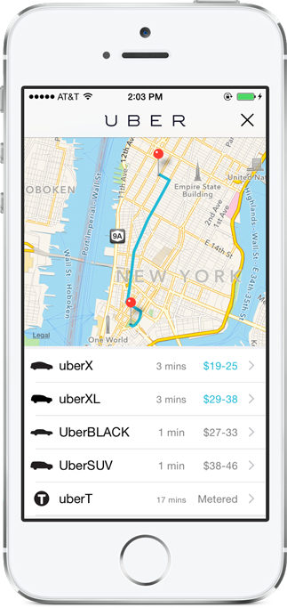

# GPUberView
Summon Uber from your iOS app with 2 lines of code.



## Quick Start

```objective-c
#import <GPUberViewController.h>

// ...

// supply the pickup and drop-off locations
CLLocationCoordinate2D pickup = CLLocationCoordinate2DMake(40.7471787,-73.997494);
CLLocationCoordinate2D dropoff = CLLocationCoordinate2DMake(40.712774,-74.006059);
    
GPUberViewController *uber = [[GPUberViewController alloc] initWithServerToken:@"your_server_token"
                                                                      clientId:nil
                                                                         start:pickup
                                                                           end:dropoff];
[uber showInViewController:self];
```

## Demo

1. Go to the GPUberViewDemo directory.
2. Open the `.xcworkspace` (not the `.xcodeproj`) file.
3. Run the app in the Simulator or on the device.

### Note:
If the phone has the Uber app installed, tapping any of the Uber service buttons will bring it up with the appropriate parameters already set. Otherwise the Uber mobile website will be launched.


## Adding GPUberView to Your Project

### CocoaPods

```ruby
platform :ios, '7.1'
pod "GPUberView"
```


## Usage

### Register You App With Uber

To use this library you need a valid *Server Token* from Uber. You can get it here: https://developer.uber.com

### Import GPUberView

```objective-c
#import <GPUberViewController.h>
```

### Initialize the GPUberViewController

- pass in the desired *pickup* and *dropoff* `CLLocationCoordinate2D` values
- pass in your Uber *server token* for authentication
- **optional:** pass in your Uber *client id* to get credits for new user signups


```objective-c
CLLocationCoordinate2D pickup = CLLocationCoordinate2DMake(40.7471787,-73.997494);
CLLocationCoordinate2D dropoff = CLLocationCoordinate2DMake(40.712774,-74.006059);
    
GPUberViewController *uber = [[GPUberViewController alloc] initWithServerToken:@"your_server_token"
                                                                      clientId:nil
                                                                         start:pickup
                                                                           end:dropoff];
```

### (Optional) Add User Signup Parameters

Adding these parameters will make the new user sign-up process smoother in case the user does not have the Uber app installed.

```objective-c
uber.firstName = @"John";
uber.lastName = @"Doe";
uber.email = @"john@example.com";
uber.countryCode = @"US";
uber.mobileCountryCode = @"1";
uber.mobilePhone = @"2125554444";
uber.zipcode = @"10001";
```

### Show GPUberView

```objective-c
[uber showInViewController:self];
```

